# Economics Data Analysis Tool

[View published application on Heroku](https://p3-data-analysis.herokuapp.com/).

[View Google Sheets Data used for the project](https://docs.google.com/spreadsheets/d/1q9xDlLLc2jBNZncPqXOUpQ4JlAWxshT-2HE1O2b6yNc/edit?usp=sharing).

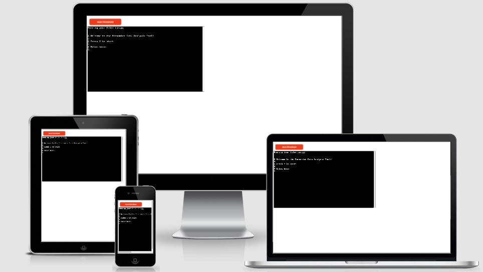

Image from [Am I Responsive](http://ami.responsivedesign.is/).

## Project Overview

The Economics Data Analysis Tool is a terminal based application that allows for data calculation and plotting using Google Sheets. This has been created as part of my Project 3 for Code Institute.

## Table of Contents

1. [User Experience (UX)](#ux)
    * [Strategy](#strategy)
        * [Project Goals](#project-goals)
        * [User Stories](#user-stories)
    * [Scope](#scope)
    * [Design](#design)
    * [Skeleton](#skeleton)
        * [Flowchart](#flowchart)
2. [Features](#features)
    * [Current Features](#current-features)
    * [Future Features](#future-features)
3. [Technologies Used](#tech-used)
4. [Testing](#testing)
    * [User Stories Testing](#user-testing)
    * [Validation Testing](#validation-testing)
    * [Known Issues and Resolutions](#issues)
5. [Deployment](#deployment)
6. [Credits](#credits)
7. [Acknowledgements](#acknowledgements)

## User Experience (UX) 

## Strategy 

### Project Goals 

The main goal for the Economics Data Analysis Tool is to provide a terminal based application which allows the user to import data from Google Sheets, and complete various calculations with the scope for plotting the data as the end result.

The main target audience for this application is a fictional economist who is interested in analysing various economic data for the UK over the past 10 years. The application would allow for such analysis by completing various calculations and exporting this data back to Google Sheets, as well as allowing the economist to plot data based on their selection. 

### User Stories 

* __Site User Goals:__

    * I want to import data from Google Sheets.
    * I want to calculate the total sum for each column of data and update the worksheet.
    * I want to calculate the average for each column of data and update the worksheet.
    * I want to calculate the estimate for each column of data for the next year and update the worksheet.
    * I want to plot the data across all available 'Years' for the selected column inclusive of the estimate data and choose the plot type.
    * I want to view the underlying data for the plotted output.

* __Site Owner Goals:__

    * I want to provide an application which allows user to import data from Google Sheets.
    * I want to provide an application which allows for data calculation for imported data (sum, average, estimate).
    * I want to provide an application which allows user to plot data based on their selection.
    * I want to provide an application which allows user to view the data selected for the plotting.

## Scope 

To achieve the strategy goals, I want to implement the following features:

* A function which will import the data from Google Sheets.
* A function which will calculate the total sum and update the worksheet.
* A function which will calculate the average and update the worksheet.
* A function which will calculate the estimate for next year and update the worksheet.
* A function which will allow the user to select column to plot data for y-axis.
* A function which will allow user to select the plot type from the listed options.
* A function which will plot data based on the selection and confirm to the user that this has been plotted, in addition displaying the data selected for the plot on the terminal.

## Design 

As this is terminal based application, the design is kept as the basic terminal colours and fonts as per the template used for the deployed project.

## Skeleton 

### Flowchart 

Due to the project being a terminal based application, no wireframes were created for this. Instead a flowchart has been created to display the application process.

Flowchart was created using [diagrams.net](https://www.diagrams.net/).

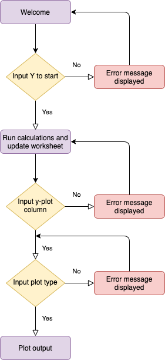

## Features 

### Current Features 

__Main__:

The main() functions purpose is to home all the other functions to run in order for the application. Once this function finishes running, the user has reached the end of the application and is displayed with and goodbye message and an additional message of how to start the application again if they wish to.

__Start__:

From the start() function the user is presented with an introductory message on the terminal and is prompted for input to begin the calculations. The input features was added so the user is able to choose when they want to begin the application to run the relevant calculations. By entering the correct input the user is presented with a message to say that calculation are beginning, any incorrect input is accounted for and accordingly returned to the user to state that the input entered is wrong, so they can attempt to enter again until it is correct.

__Get Column Data__:

Once the application is initiated by the user, the get_column_function() is run in the background to import the data from the Google Sheets worksheet. This enables for the calculations to be completed to analyse the data.

__Calculate Data__:

The calculate_sum(), calculate_average() and calculate_estimate() are functions which complete calculations using the imported data from Google Sheets. The calculate_sum() function uses the obtained column data and calculates the total sum for each column and returning this total in a newly created list. The calculate_average() function uses the sum calculated previously to now calculate the average for each column by diving the sum by total rows of data. This is then returned in a newly created list. The calculate_estimate() function uses the average figure for each column to calculate an estimate for the following year. This is then returned in a newly created list. The list for the estimate data is inserted with a new entry for the year '2021' to allow for exporting data in an appropriate manner which can then be utilised for plotting. In each of these cases the user is presented with a message in the terminal to display and confirm once the data has been calculated.

__Update Worksheet__:

The update_worksheet() function which takes 2 parameters; data and worksheet, uses the previously calculated sum, average and estimate figures for each column and exports the data back to Google Sheets for the relevant worksheet. Each of the calculations have their own worksheet, 'sum', 'average' and 'estimate' where the rows are updated for each column with the calculated data which the user can view on the worksheets. The user is presented with a message in the termianl to confirm that the relevant worksheet has been updated with the calculated data.

__Create and Append DataFrame__:

The create_data_frame() function takes 1 parameter worksheet and the code here used utilises the pandas library. Data is obtained from the 'project_data' and 'estimate' worksheets to create 2 DataFrames for each of these data sets. The user is presented with a message in the terminal to state that the DataFrame has been created for the relevant worksheet. The append_data_frame() which takes 2 parameters df1 and df2, uses the 2 created DataFrames for 'project_data' and 'estimate" to combine these two DataFrames into one, so the DataFrame will consists of the existing 10 years of data plus the estimate for the next year.

__Select Plot and Validate__:

The select_y_plot() function presents the user with an input option in the terminal to select the column they would like for the y-plot (the x-plot by default will be the 'Years' as the user wishes to analyse the data over the given timeframe). The message presented specifies that the column name entered should be exactly the same as the ones obtained from the Google worksheet and also provides an example of an input. The input is then validated via the validate_y_plot() function which takes 1 parameter value of the input the user has entered. This is to to ensure that the user has entered this correctly against a pre-existing list created with the correct column names. Any incorrect input will display an error messahe and prompt the user to try again, the correct input is granted with a message to say that the input is valid.

The select_plot_type() function presents the user with an input option in the terminal to select the type of plot they would like to produce. There are 3 options presented to the user to choose from and an example added in the terminal via print statement. This is then validated with the validate_plot_type() which takes 1 parameter value of the input the user has entered. The input is checked against a list of correctly defined choices and any that do not match to what user has entered will return an error message in the terminal to the user to indicate that the input was entered incorrectly. Correctly entered input will display the user with a message to state that the input is valid.

__Plot Output__:

The plot_output() function takes 3 parameters; data, value and kind. The data is using the previously appended DataFrame, the value is using the input from user for the y-plot column and kind is using the input from user for the plot type. In this function, I have also utilised the plotext library to allow for plotting data in the terminal. The user is presented with a message to say that data is being plotted and once completed, confirmation is received that the plotting is successful. The terminal message also displays to the user their selected choice of column and plot type and returns the columns from the appended DataFrame to show the uderlying data used for the plot on the terminal. Please note that the plot itself is not displayed in the terminal for the user to view, this issue is further disucssed in the __Known Issues and Resolutions__ section.

### Future Features 

Due to time constraints, I was unable to apply additional features, in the future I would like to implement the following:

* Add function to allow the user to enter data in the terminal and have this exported to the Google worksheet.
* Add feature to allow the user to view the output of the plotted data (this is an issue discussed in the __Known Issues and Resolutions__ section).

## Technologies Used 

For this project the main language used is __Python__.

I have also utilised the following frameworks, libraries, and tools:

* [Pandas](https://pandas.pydata.org/): 
    * Pandas Library has been used to allow for the creation of DataFrames and for plotting data.
* [Plotext](https://pypi.org/project/plotext/):
    * Plotext has been used to for plotting data in the terminal.
* [GitPod](https://www.gitpod.io/): 
    * I used GitPod as the IDE for this project and Git has been used for Version Control.
* [GitHub](https://www.github.com/): 
    * GitHub has been used to create a repository for the project and receive updated commits from GitPod.
* [Heroku](https://www.heroku.com/): 
    * Heroku has been used to create a repository to host the project and receive updated commits from GitPod.
* [gspread](https://pypi.org/project/gspread/): 
    * gspread has been used to access, update and manipulate data from Google Sheets.
* [Google Cloud Platform](https://cloud.google.com/): 
    * Google Cloud Platform has been used for APIs and credentials to be able to access Google Sheets with the relevant data.
* [World Bank Data](https://data.worldbank.org/): 
    * World Bank was used as a source of the data for the economic indicators used in this project.
* [PEP8 Online Validation Service](http://pep8online.com/): 
    * The PEP8 Online Validation Service was used to validate the Python document for this project and to identify any issues with the code.
* [StackOverflow](https://stackoverflow.com/): 
    * StackOverflow was used to assist with any troubleshooting issues during the course of the project.
* [diagrams.net](https://www.diagrams.net/):
    * diagrams.net was used to create the flowchart for this project.
* [Am I Responsive](http://ami.responsivedesign.is/):
    * Am I Responsive was used to create the header image for the README file.

## Testing 

### User Stories Testing 

The application is built using APIs to access Google Sheets data that the user is interested in analysing.

The data is accessed from the following [link](https://docs.google.com/spreadsheets/d/1q9xDlLLc2jBNZncPqXOUpQ4JlAWxshT-2HE1O2b6yNc/edit?usp=sharing).

Screenshot of the data sample located on the Google worksheet for project_data:

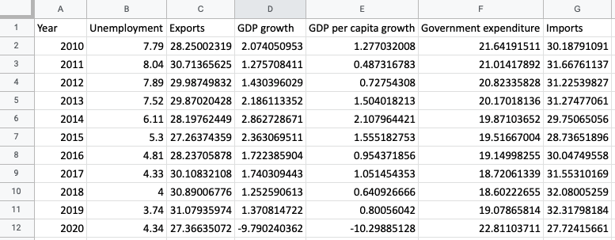

Once the application is run for the first time, the user is presented with an introductory message to the Economics Data Analysis Tool. The user is then prompted to confirm if they wish to start the application by entering input 'Y'. With the addition of the input option, the user can control when they want to begin the application and continue with the calculation of data rather than the application running straigh away upon the user accessing this. Once the correct input has been entered, the user is presented with confirmation that the input entered is valid, and the application proceeds to run and the data is imported from the Google worksheet.

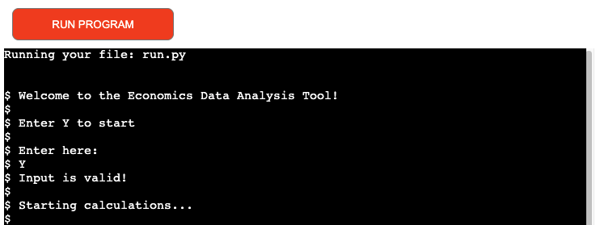

If the user enters an incorrect input, this is also captured in the code whereby the user will be displayed with an error message to state that the input entered is not valid. The input will be presented once more to allow the user the re-enter the input correctly. The loop will continue to run until the user has entered the correct input from which the loop is exited and the user is then able to proceed.

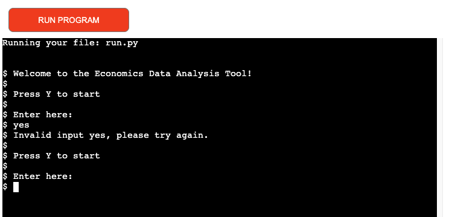

The following user stories have been achieved:

* I want to import data from Google Sheets.
* I want to provide an application which allows user to import data from Google Sheets.

Once the user has initiated the calculations via the correct input, the functions will begin to run in order to calculate the sum, average and estimate as well as update the relevant worksheets for each calculation on the Google Sheets document. The user is displayed with a message in the terminal to confirm that the calculations have been completed and that the worksheets have been updated.

Screenshot below of the print statement displayed in the terminal when the application is running to complete the calculations and update the worksheets:

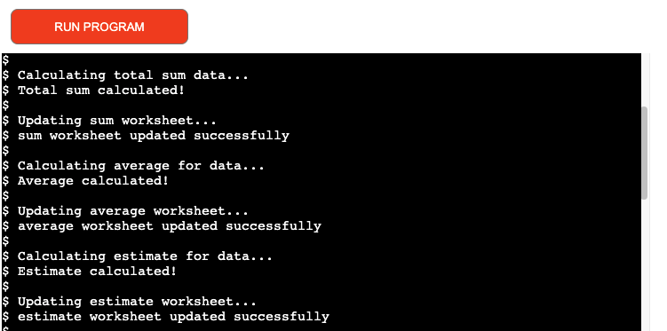

Screenshots below of the output produced and exported to the Google Sheets document for the relevant worksheet:

__Sum__

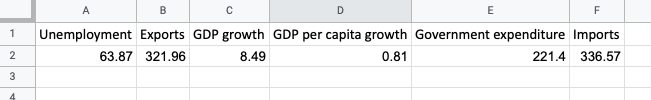

__Average__

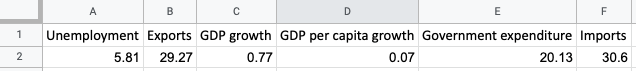

__Estimate__

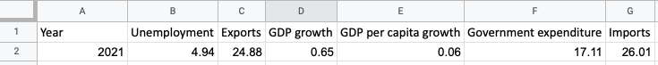

The following user stories have been achieved:

* I want to calculate the total sum for each column of data and update the worksheet.
* I want to calculate the average for each column of data and update the worksheet.
* I want to calculate the estimate for each column of data for the next year and update the worksheet.
* I want to provide an application which allows for data calculation for imported data (sum, average, estimate).

Following this the two DataFrames are created using the project_data and estimate worksheets, this is displayed in the terminal as confirmation to the user that the action has taken place. The DataFrames are then combined to allow the user to plot data for Years 2010 to 2021 for the selected column. The user is next presented with the option to select a column for the y-plot, and provided with further guidance that the input of the column should be exactly the same as the name on the worksheet where the data is imported from. An example is also provided to the user of the input. Once the user has entered the input correctly, a confirmation statement is received to state to the user that the input is valid. This then proceeds onto the next section where the user is once again presented with the input option to select the plot type. The terminal also displays the available options the user can choose from and an exmaple of what the input should look like. Once the user has entered the correct input, a message is then displayed to confirm that the input is valid.

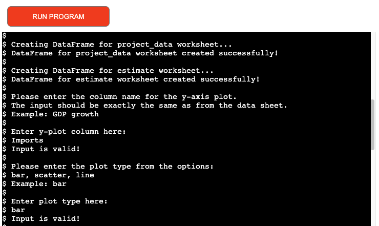

If the user enters the incorrect input, at either of the two stages to select the y-plot column and/or the plot type, this is accounted for in the code with a try and except statement. An error message is displayed in the terminal for the incorrect input and the loop is continued to display the question again to allow the user to enter the input correctly which will break out the loop and continue with the application. 

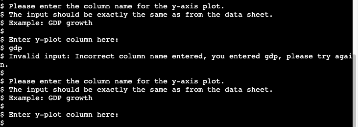

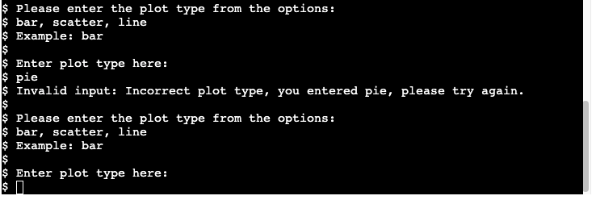

The final stage of the application is plotting the data once the user has entered valid input. The user is presented with a message in the terminal to state that the data is being plotted, and once this is completed, the user is presented with confirmation to state that this is completed. An additional message is displayed to show that the data is plotted based on the user's previous slection for the y-plot column and the plot type and the DataFrame columns are returned in the terminal to display to the user the underlying data used for plotting. The application ends with a goodbye message to the user, and an option to re-run the application once again if the user wishes to do so.

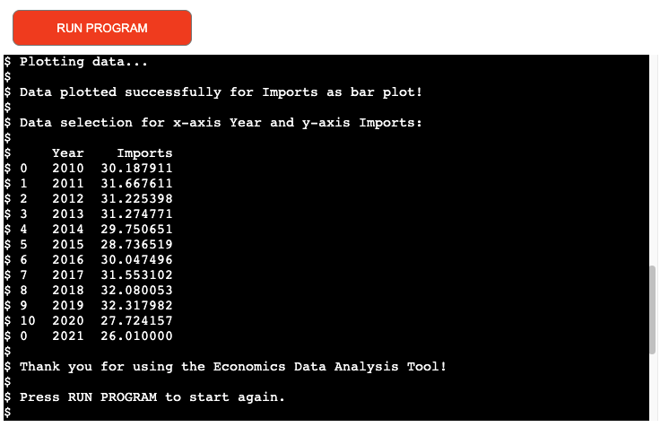

The following user stories have been achieved:

* I want to plot the data across all available 'Years' for the selected column inclusive of the estimate data and choose the plot type.
* I want to view the underlying data for the plotted output.
* I want to provide an application which allows user to plot data based on their selection.
* I want to provide an application which allows user to view the data selected for the plotting.

### Validation Testing 

To test the Python code, I used the __PEP8 Online Validation Service__:

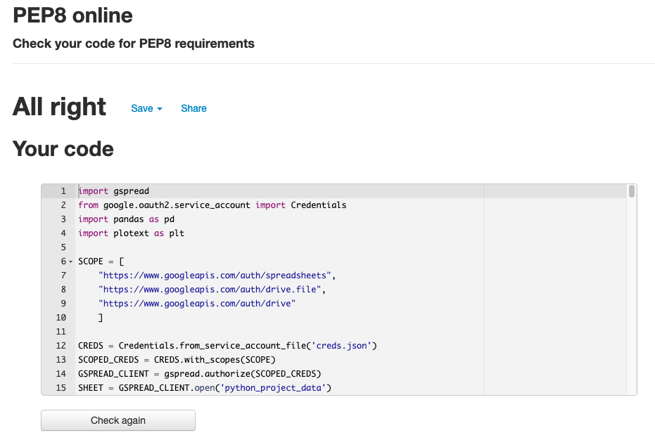

No issues were detected with the code.

This website was tested on the following browsers:

* Google Chrome
* Safari
* Mozilla Firefox

Although this is a web application, it is visible on mobile and tablets, even though it is not responsive. This web application was also tested on the following devices:

* iPhone 11 Pro
* iPad Pro
* MacBook Air

### Known Issues and Resolutions 

* During testing an issue was identified within the append_data_frame(df1, df2) function. The purpose of this function is to append the two DataFrames created for the 'project_data' and 'estimate' worksheet. However, as the user is able to re-run the application to calculate the data multiple times if they wish to do so, this results in the 'estimate' worksheet having multiple rows of data. Therefore, when the DataFrames are appended, this can result in the year 2021 for the estimate having multiple entries within the appended DataFrame, when only the most recent row of data calculated is required. To resolve this issue, the code was updated from df_append = df1.append(df2) to the following df_append = df1.append(df2.tail(1)). Utilising the pandas library, the addition of tail(1) ensured that when appending the two DataFrames, for the 'estimate' DataFrame, only the last row of data was returned which was the most recently calculated. Therefore, this would no longer pose the issue where multiple rows for the estimate data is being returned if the user had previously run the application multiple times to calculate this.

* During testing an issue was identified within the plot_output(data, value, kind) function. The purpose of this function is to plot the output to the terminal based on the user's previous inputs for the y-plot column and plot type using the following code plt.show(). This posed no issues when the code was run in GitPod, as the output was plotted in the terminal and the user was able to view this. However, once the project was deployed to Heroku and tested again using the template provided, the code for plt.show() did not run as expected and resulted in an error displayed in the terminal. Due to the plotext terminal plotting not being supported with the template used for deployment and additional time constraints this issue could not be fully resolved. To overcome the issue, the code was re-worked for this function. Instead of using plt.show() to display the plotted output in the terminal, instead the user is now displayed with a message to confirm that the data plot was successful based on their selection for the y-plot column and the plot type. In addition, the user is returned with the selected column from the DataFrame used for the plot to show the data used for plotting. 

An example below of what the plotted output looks like in the terminal once this code is run in GitPod:

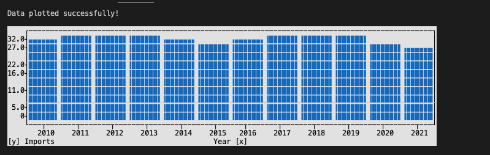

Below is the error message displayed in Heroku for the deployed project using the template running this code:

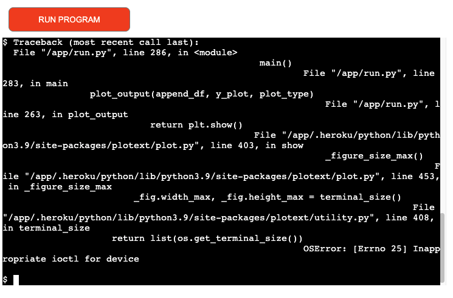

Alternative fix to issue code to display to user once data is plotted:

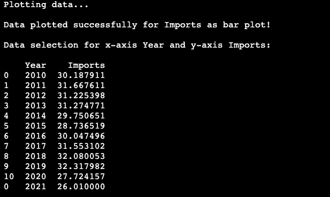

## Deployment 

The project was developed using GitPod and was deployed via the GitHub repository to Heroku.

The following steps were followed to deploy this project:

1. From the Heroku dashboard, select 'New' in the top right hand corner.
2. Click 'Create new app'.
3. Enter the app name and choose region as Europe. 
4. Click 'Create app'.
5. Select the 'Settings' tab, and scroll down to 'Buildpacks'. 
6. Add 'Python' and save changes, then add 'Node.js' and save the changes again.
7. Scroll down to 'Config Vars' section, and add the 'KEY' and 'PORT' for the credentials and additional 8000 port for running the app.
8. At the top of the page, click on the 'Deploy' section.
9. Select Github as deployment method.
10. Select 'Connect to Github', and locate the repository name and click on 'Connect' to link my Heroku app to my Github repository code.
11. Scroll further down, select 'Enable Automatic Deploys' and then select 'Deploy Branch' to deploy project.
12. After it has successfully deployed a 'view' button appears on screen and when clicked opens the deployed application.

## Credits 

### Content

The economic data used for the project was obtained from the [World Bank Data](https://data.worldbank.org/) for the following parameters:

* Unemployment, total (% of total labor force) (modeled ILO estimate)
* Exports of goods and services (% of GDP)
* GDP growth (annual %)
* GDP per capita growth (annual %)
* General government final consumption expenditure (% of GDP)
* Imports of goods and services (% of GDP)

The data covered was for UK over 10 years from 2010 to 2020.

### Code

* The Code Institute Love Sandwiches tutorial for Python was used to assist with creating this project. Certain code was borrowed and used for the run.py file, in addition to some of the borrowed code being customised specifically for the project and new code added by me.

## Acknowledgements 

* I would like to thank my family and friends for their support throughout this project.
* My mentor, Guido Cecilio, for being of great support and providing valuable guidance and feedback throughout this process.
